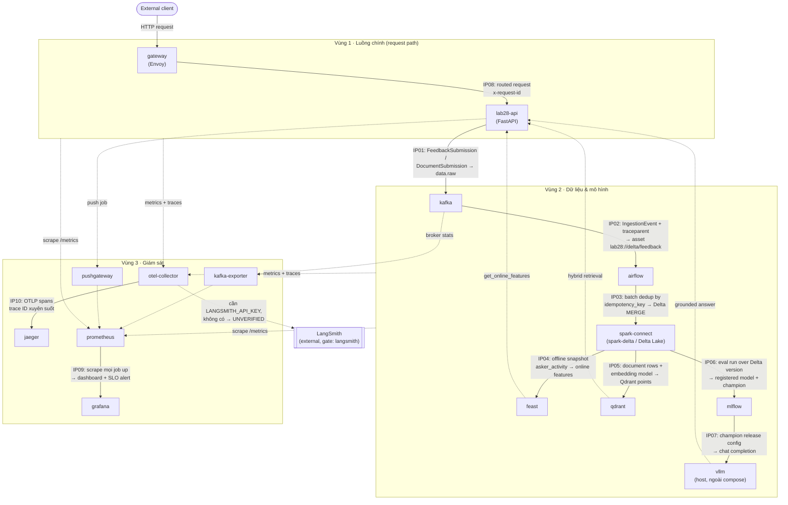

# Kiến trúc hệ thống — Day 28 Track 2 (lab28-platform)

Nguồn đọc: `compose.yaml`, `contracts/integration-matrix.yaml`,
`src/lab28_platform/contracts.py` (bảng `SERVICE_OWNERS`). Tài liệu này chỉ
**mô tả những gì đã có trong repo**; không có service nào bị sửa, không có
lệnh `docker` nào được chạy để tạo ra tài liệu này.

## 1. Diagram — 3 vùng, 10 điểm tích hợp (IP01–IP10)

Ghi chú đọc diagram:

- 10 cạnh in đậm (không phải nét đứt) là 10 điểm tích hợp IP01–IP10 lấy đúng
  `slide_name` / `input_contract` / `output_contract` từ
  `contracts/integration-matrix.yaml`.
- Các cạnh nét đứt (`feast/qdrant/vllm → api`, và toàn bộ fan-in vào
  `otel-collector`/`prometheus`) không mang nhãn IP riêng — chúng biểu diễn
  vế "input" gộp của IP09 ("Prometheus scrape của mọi service có `/metrics`")
  và IP10 ("OTLP spans từ gateway, API, Kafka, Airflow, Spark, Feast, Qdrant,
  vLLM" — đúng danh sách trong `required_spans`), vẽ ở mức vùng (`Z1`, `Z2`)
  cho gọn thay vì 9 mũi tên riêng lẻ.
- `vllm` không phải service trong `compose.yaml`; nó chạy trên host và được
  `api` gọi qua `LAB28_VLLM_BASE_URL` (mặc định
  `http://host.docker.internal:8001/v1`, dòng 224 `compose.yaml`). `LangSmith`
  không nằm trong compose hay repo — vẽ để hoàn chỉnh IP10, có `gate:
  langsmith` (cần `LANGSMITH_API_KEY`, thiếu thì kết quả là `UNVERIFIED`).
- `spark-connect` là tên service trong `compose.yaml`; khoá tương ứng trong
  `SERVICE_OWNERS` là `spark-delta` — cùng một thành phần Spark Connect +
  Delta Lake, chỉ khác tên gọi giữa hai file.

## 2. Chú giải IP01–IP10 (layer + owner, từ `integration-matrix.yaml`)

| IP | Slide name | Layer | Owner | Cạnh trong diagram |
|----|-----------|-------|-------|---------------------|
| IP01 | Data ingestion → Kafka | L2 Data | team-ingestion | `api → kafka` |
| IP02 | Kafka → Airflow pipeline | L2 Data | team-ingestion | `kafka → airflow` |
| IP03 | Pipeline → Delta Lake / Lakehouse | L2 Data | team-data | `airflow → spark-connect` |
| IP04 | Lakehouse → Feature Store (Feast) | L3 ML | team-data | `spark-connect → feast` |
| IP05 | Data → Vector Store (embeddings) | L2 Data | team-serving | `spark-connect → qdrant` |
| IP06 | MLflow → Model Registry | L3 ML | team-data | `spark-connect → mlflow` |
| IP07 | Model → vLLM / SGLang serving | L1 Compute | team-serving | `mlflow → vllm` (gate: `gpu`) |
| IP08 | Serving → API Gateway | L1 Compute | team-platform | `gateway → api` |
| IP09 | All components → Prometheus / Grafana | L4 Ops | team-platform | `prometheus → grafana` |
| IP10 | All components → LangSmith tracing | L4 Ops | team-platform | `otel-collector → jaeger` (gate: `langsmith`) |

## 3. Bảng ownership

Cột "owner" lấy nguyên văn từ `SERVICE_OWNERS` trong
`src/lab28_platform/contracts.py`; `jaeger`, `pushgateway`, `kafka-exporter`
**không** có mặt trong `SERVICE_OWNERS` — chúng được xếp vào Vùng 3 và gán
"team-platform (suy luận)" vì đây là phụ trợ cho stack giám sát mà
`team-platform` đứng tên theo mô tả vai trò trong `integration-matrix.yaml`
(`team-platform: "... gateway, OTEL collector, Prometheus, Grafana, K8s/
GitOps"`), không phải một khoá tường minh trong bảng owners.

| Service | Owner | Vai trò trong luồng |
|---|---|---|
| `gateway` | team-platform | Nhận request ngoài, gắn `x-request-id`, route vào `api` (IP08); nguồn scrape cho Prometheus, nguồn span cho OTEL. |
| `lab28-api` | team-serving | Nhận request đã route; publish `IngestionEvent` lên `data.raw` (IP01); gọi `feast`/`qdrant`/`vllm` để trả lời `/api/v1/ask`; push metrics qua `pushgateway`, xuất trace qua OTEL. |
| `kafka` | team-ingestion | Broker cho `data.raw`/`data.processed`/`model.events`/`data.raw.dlq`; nguồn cho Airflow pipeline (IP02). |
| `airflow` | team-ingestion | Tiêu thụ `data.raw`, chạy DAG batch, MERGE dữ liệu đã dedupe vào Delta (IP03). |
| `spark-delta` (compose: `spark-connect`) | team-data | Lakehouse; nguồn snapshot cho Feast (IP04), nguồn document cho embedding vào Qdrant (IP05), nguồn version cho eval MLflow (IP06). |
| `feast` | team-data | Feature server online; phục vụ `asker_serving_v1` cho `api` khi trả lời `/ask`. |
| `qdrant` | team-serving | Vector store; phục vụ hybrid retrieval cho `api`. |
| `mlflow` | team-data | Model registry; giữ alias `champion`; cấp release config cho `vllm` (IP07). |
| `vllm` | team-serving | Sinh câu trả lời từ model champion; chạy ngoài compose, gọi qua `LAB28_VLLM_BASE_URL`. |
| `otel-collector` | team-platform | Thu span/metrics OTLP từ toàn hệ thống; xuất sang `jaeger` và (có gate) LangSmith (IP10). |
| `prometheus` | team-platform | Scrape `/metrics` của mọi service; nguồn cho `grafana` + alert (IP09). |
| `grafana` | team-platform | Dashboard/alert dựng từ Prometheus (đầu ra IP09). |
| `jaeger` | team-platform (suy luận) | Backend trace cục bộ nhận OTLP từ `otel-collector`, tra được `trace_id` cho evidence IP10. |
| `pushgateway` | team-platform (suy luận) | Nhận metric kiểu push từ `api` (job không sống đủ lâu để bị scrape trực tiếp), Prometheus scrape lại từ đây. |
| `kafka-exporter` | team-platform (suy luận) | Đọc trạng thái broker Kafka, phơi `/metrics` cho Prometheus scrape. |

## 4. Ownership của bài làm

Bài làm thực hiện **cá nhân** (repo chỉ có một tác giả — xem `git log`, branch
làm việc `ca-nhan-anhduc`). Người thực hiện đã đi qua đủ cả 5 vai trò được
định nghĩa trong `contracts/integration-matrix.yaml`:

- `team-ingestion` — Kafka topics, producer, Airflow DAG, DLQ/replay (IP01, IP02).
- `team-data` — Spark/Delta, Feast repository, materialization, model release (IP03, IP04, IP06).
- `team-serving` — FastAPI orchestration, Qdrant, vLLM client, degraded paths (IP05, IP07).
- `team-platform` — gateway, OTEL collector, Prometheus, Grafana, K8s/GitOps (IP08, IP09, IP10).
- `team-presenter` — demo script, evidence pack, failure narration (xem `docs/demo-runbook.md`, `docs-nop-bai/demo-checklist.md`).

Diagram và bảng ownership ở trên phản ánh đúng việc một người đã cấu hình và
nối cả 10 điểm tích hợp xuyên suốt 5 vai trò đó, không phải công việc được
chia cho nhiều người.
